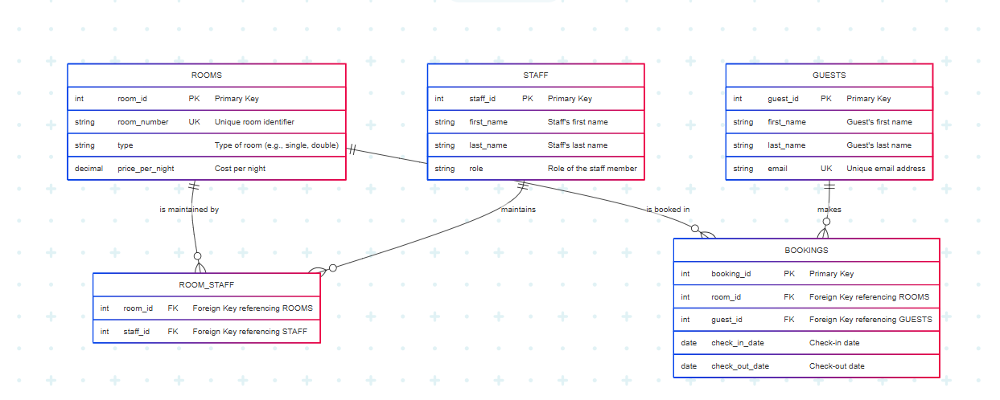

# Hotel Management System

## Overview
This project implements a MySQL database for managing hotel operations, including rooms, guests, staff, and bookings. It uses well-defined tables, constraints, and relationships to ensure data integrity.

## Features
- **Tables**: `Rooms`, `Guests`, `Staff`, `Bookings`, `Room_Staff`.
- **Constraints**: Primary Keys (PK), Foreign Keys (FK), NOT NULL, UNIQUE.
- **Relationships**:
  - One-to-Many: `Rooms` to `Bookings`, `Guests` to `Bookings`.
  - Many-to-Many: `Rooms` to `Staff` via `Room_Staff`.

## Database Schema
- **Rooms**: `room_id` (PK), `room_number` (UNIQUE), `type`, `price_per_night`.
- **Guests**: `guest_id` (PK), `first_name`, `last_name`, `email` (UNIQUE).
- **Staff**: `staff_id` (PK), `first_name`, `last_name`, `role`.
- **Bookings**: `booking_id` (PK), `room_id` (FK), `guest_id` (FK), `check_in_date`, `check_out_date`.
- **Room_Staff**: `room_id` (PK, FK), `staff_id` (PK, FK).

## Entity-Relationship Diagram


## Setup Instructions
1. **Install MySQL**: Download and install MySQL from [mysql.com](https://dev.mysql.com/downloads/). Ensure the server is running.
2. **Create the Database**:
   ```sql
   CREATE DATABASE hotel_db;
   USE hotel_db;
   ```
3. **Import the SQL File**:
   - Using MySQL Workbench:  
     Go to `File > Open SQL Script`, select `hotel_management.sql`, and execute.
   - Using the command line:  
     ```bash
     mysql -u root -p hotel_db < hotel_management.sql
     ```
4. **Verify the Setup**:
   - List tables:  
     ```sql
     SHOW TABLES;
     ```
   - Describe a table:  
     ```sql
     DESCRIBE Rooms;
     ```

## Files
- `hotel_management.sql`: Database schema.
- `erd.png`: Entity-Relationship Diagram.
- `README.md`: Project documentation.
